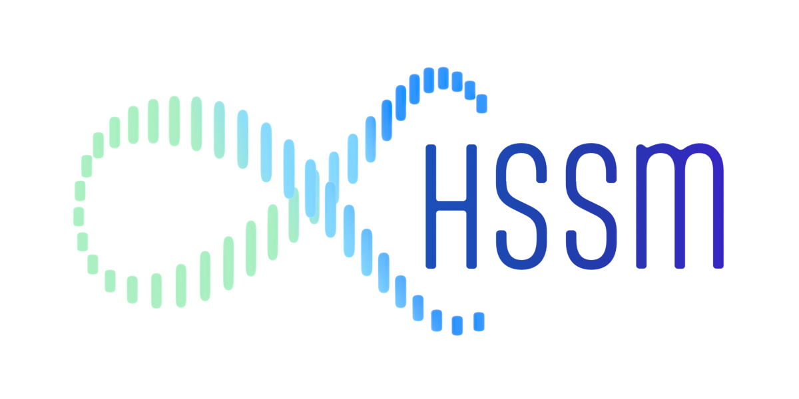

<div style="position: relative; width: 100%;">
  
  <a href="https://ccbs.carney.brown.edu/brainstorm" style="position: absolute; right: 0; top: 50%; transform: translateY(-50%);">
    
  </a>
</div>

## HSSM - Hierarchical Sequential Sampling Modeling


[](https://github.com/ambv/black)

### Overview

HSSM is a Python toolbox that provides a seamless combination of state-of-the-art likelihood approximation methods with the wider ecosystem of probabilistic programming languages. It facilitates flexible hierarchical model building and inference via modern MCMC samplers. HSSM is user-friendly and provides the ability to rigorously estimate the impact of neural and other trial-by-trial covariates through parameter-wise mixed-effects models for a large variety of cognitive process models. HSSM is a <a href="https://ccbs.carney.brown.edu/brainstorm">BRAINSTORM</a> project in collaboration with the Center for Computation and Visualization and the Center for Computational Brain Science within the Carney Institute at Brown University.

- Allows approximate hierarchical Bayesian inference via various likelihood approximators.
- Estimate impact of neural and other trial-by-trial covariates via native hierarchical mixed-regression support.
- Extensible for users to add novel models with corresponding likelihoods.
- Built on PyMC with support from the Python Bayesian ecosystem at large.
- Incorporates Bambi's intuitive `lmer`-like regression parameter specification for within- and between-subject effects.
- Native ArviZ support for plotting and other convenience functions to aid the Bayesian workflow.
- Utilizes the ONNX format for translation of differentiable likelihood approximators across backends.

### [Official documentation](https://lnccbrown.github.io/HSSM/).

## Installation

`hssm` is available through PyPI. You can install it with pip via:

```
pip install hssm
```

You can also install the bleeding-edge version of `hssm` directly from this repo:

```
pip install git+https://github.com/lnccbrown/HSSM.git
```

You will need optional dependencies to use JAX-based samplers and graph the models.
Please refer to our [installation guide](https://lnccbrown.github.io/HSSM/getting_started/installation/)
for more detailed instructions.

**Note**: Possible solutions to any issues with installations with hssm can be located
[here](https://github.com/lnccbrown/HSSM/discussions). We recommend leveraging an
environment manager with Python 3.10~3.11 to prevent any problems with dependencies
during the installation process. Please note that hssm is tested for python 3.10,
3.11. As of HSSM v0.2.0, support for Python 3.9 is dropped. Use other python
versions with caution.

## Example

Here is a simple example of how to use HSSM:

```python
import hssm

# Set float type to float32 to avoid a current bug in PyMC
# This will not be necessary in the future
hssm.set_floatX("float32")

# Load a package-supplied dataset
cav_data = hssm.load_data('cavanagh_theta')

# Define a basic hierarchical model with trial-level covariates
model = hssm.HSSM(
    model="ddm",
    data=cav_data,
    include=[
        {
            "name": "v",
            "prior": {
                "Intercept": {"name": "Normal", "mu": 0.0, "sigma": 0.1},
                "theta": {"name": "Normal", "mu": 0.0, "sigma": 0.1},
            },
            "formula": "v ~ (1|participant_id) + theta",
            "link": "identity",
        },
    ],
)

# Sample from the posterior for this model
model.sample()
```

To quickly get started with HSSM, please follow [this tutorial](https://lnccbrown.github.io/HSSM/getting_started/getting_started/).
For a deeper dive into HSSM, please follow [our main tutorial](https://lnccbrown.github.io/HSSM/tutorials/main_tutorial/).

## License

HSSM is licensed under [Copyright 2023, Brown University, Providence, RI](LICENSE)

## Support

For questions, please feel free to [open a discussion](https://github.com/lnccbrown/HSSM/discussions).

For bug reports and feature requests, please feel free to [open an issue](https://github.com/lnccbrown/HSSM/issues) using the corresponding template.

## Contribution

If you want to contribute to this project, please follow our [contribution guidelines](docs/CONTRIBUTING.md).

## Acknowledgements

We would like to extend our gratitude to the following individuals for their valuable contributions to the development of the HSSM package:

- [Bambi](https://github.com/bambinos/bambi) - A special thanks to the Bambi project for providing inspiration, guidance, and support throughout the development process. [Tomás Capretto](https://github.com/tomicapretto), a key contributor to Bambi, provided invaluable assistance in the development of the HSSM package.

Those contributions have greatly enhanced the functionality and quality of the HSSM.
