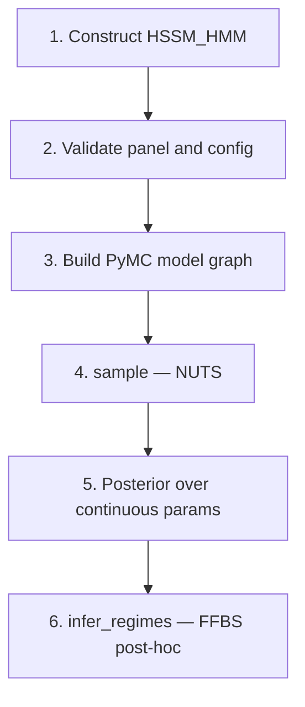
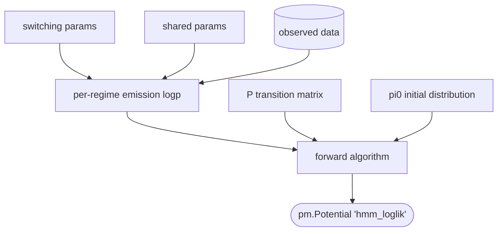

# HSSM-HMM Class: Design Document

**Issue:** [#957](https://github.com/lnccbrown/HSSM/issues/957)
**Status:** v1 feasibility-validated
**Companions:** [hssm_hmm_overview.md](./hssm_hmm_overview.md) (high-level summary for applied users); [hssm_hmm_math.md](./hssm_hmm_math.md) (full math spec — v1 model in §14; planned Phase 6.1 hierarchical extension in §5–13)

This is the rigorous design for `HSSM_HMM`. The TL;DR below is the 2-minute summary; the "Where to read next" block at its bottom is the navigation map into the rest of the document.

---

## TL;DR

**The model.** Each trial belongs to one of `K` hidden regimes. The regime sequence evolves as a Markov chain (`K×K` transition matrix `P`, initial distribution `pi0`). Within a regime, the trial's `(rt, response)` is generated by a standard SSM (DDM, LBA, ...) with regime-specific values for the *switching* parameters and shared values for the rest. Participants are independent in v1.

**The core challenge.** NUTS only differentiates continuous parameters, so the discrete regimes are marginalised out via the forward algorithm. This produces a single *scalar* log-likelihood per evaluation — which **bypasses** `make_distribution`'s per-row contract that HSSM assumes everywhere else (see §2.2, §3.4). The plan reconciles this by reconstructing per-trial values post-hoc, after sampling.

**The architecture in one picture.**

```
SAMPLE-TIME  (each NUTS leapfrog step):
  one batched pytensor.scan over T       (participant axis vectorised in tensors)
    -> scalar L(theta)
    -> pm.Potential("hmm_loglik", L)
    -> idata.posterior(theta_switching, theta_shared, P, pi0)

POST-HOC  (called once by the user, eager NumPy):
  same forward recursion, NumPy implementation
    +-- + backward sample          -> infer_regimes()           -> posterior_regimes
    +-- + delta_t = log Z_t - log Z_{t-1} -> compute_log_likelihood() -> idata.log_likelihood
```

Sample-time is one JIT-compile unit, roughly constant in `N`. Post-hoc is decoupled from the sampler backend (NumPy), so it works uniformly across all emission backends (analytical / LAN-jax / LAN-pytensor).

**Load-bearing decisions** (full justification and prototype evidence in §10.1):

- **Scalar marginal via `pm.Potential`**, not per-trial-deltas-as-loglik. The deltas form destabilises NUTS (R-hat ≈ 1.83); the scalar marginal converges to the tutorial bit-for-bit (R-hat ≈ 1.0). Per-trial logp is recovered post-hoc for `arviz.loo` / `arviz.waic`.
- **One batched `scan`, not a Python loop over participants.** The loop pattern didn't finish a 400-draw run at `N=20` in 40+ min — each per-subject scan becomes its own JIT-compile unit.
- **`ordered` transform on one anchor switching parameter** for label-switching. A soft `pm.Potential` barrier works at `K=2` but breaks at higher `K` (NUTS jumps across it in a single step).
- **Build the PyMC model directly, no bambi delegation.** The HMM's defining latents (transition matrix, regime sequence) are not row-indexed quantities bambi's formula system can declare.
- **Balanced panels only in v1.** Required by the rectangular `(N, T, …)` reshape that powers the batched `scan`. Validated by `validate_balanced_panel` before the builder runs.
- **Reject `missing_data`, `deadline`, `p_outlier`, `lapse` in v1.** The first two re-order rows and would corrupt the trial-axis Markov structure; the latter two assume the per-trial-mixture contract that HMM doesn't satisfy.

**Validation status** (full table in §7.4; reproduction scripts in [docs/design/v1_extra_validations/](./v1_extra_validations/)). Throwaway prototype runs have settled every load-bearing decision above plus the breadth and edge-case claims:

| Dimension | Validated | Result |
|---|---|---|
| Tutorial regression | single-subject, K=2, `["v"]` | bit-for-bit match to the hand-written tutorial (4 dp) |
| Multi-participant | N=3 (K=2) and N=4 (K=3) | R-hat ≤ 1.01, 0 divergences, parameter recovery within MC error |
| `K` generalisation | K=2 and K=3 with 1–3 switching params | R-hat ≤ 1.01, 0 divergences |
| Label-switching | `ordered` transform vs. soft Potential | transform converges at all K; soft Potential **fails at K≥3** (R-hat up to 2.20) |
| Emission backends | analytical DDM; LAN DDM (`jax` + `pytensor`); LAN-only `angle` | all three converge; LAN backends agree with analytical to ≤0.02 on every parameter |
| Numerical stability | 98/2 imbalanced *and* empty (regime 1 never visited) | no NaN/Inf; unoccupied regime falls back to a prior-driven value bounded by the `ordered` constraint |
| Post-hoc FFBS | analytical DDM and LAN-only `angle` | both work via `pytensor.function`-compiled emission; 86% per-trial accuracy at K=2 |

What v1 implementation (Phase 2+) still has to verify: the `HSSMBase` override mechanics (§6.3), `compute_log_likelihood` / `infer_regimes` InferenceData wiring (§5.5, §5.6), non-default config variants, and the `missing_data`/`deadline`/`p_outlier`/`lapse` rejection plumbing. None of these would change the design if they failed.

**User-facing API.**

```python
from hssm import HSSM_HMM

model = HSSM_HMM(
    data=df,                          # long-format, balanced panel, sorted (participant, trial)
    K=2,
    decision_process="ddm",
    switching_params=["v"],           # parameters that vary by regime
    participant_col="participant_id",
)
idata   = model.sample(...)                    # standard HSSM .sample()
regimes = model.infer_regimes(idata)           # posterior over s_{n,1:T}                (§5.5)
idata   = model.compute_log_likelihood(idata)  # per-trial logp for arviz.loo / waic     (§5.6)
```

**Where to read next.**

- Want to **use** it → §6 (user-facing API).
- Want to **understand the model** → §3 (formulation), §10.1.1–10.1.5 (load-bearing decisions).
- Want to **extend** it → §4 (architecture), §8 (extension hooks for v2/v3).
- Want to **verify the design holds up** → §7.4 (feasibility-prototype validations).

---

## 1. Scope and goals

### 1.1 What this design covers

A new top-level class `HSSM_HMM` that fits **regime-switching sequential sampling models** through the same user-facing pattern as `HSSM(...)` and `RLSSM(...)`. The class wraps the manual construction shown in [docs/tutorials/hmm_ddm_regime_switching.ipynb](../tutorials/hmm_ddm_regime_switching.ipynb) so that users do not need to assemble the PyMC model by hand. See the TL;DR above for the one-paragraph model description and §3 for the formal specification.

### 1.2 v1 scope (this design)

The first version targets the **simplest useful case** so that we can:
- Ship something usable to applied users quickly.
- Validate the architectural choices against a concrete implementation.
- Match the tutorial's numerical results as a regression test.

**v1 includes:**
- Arbitrary number of regimes `K >= 2`.
- A subset of SSM parameters that switch by regime (declared as a flat list).
- All non-switching SSM parameters shared across regimes; standard HSSM priors / regressions for them.
- Balanced panel of participants (every participant has the same number of trials). v1 has **no per-participant parameter structure**: switching and shared parameters are global (the switching ones are length-K vectors indexed by regime, the shared ones are scalars). The only per-participant quantity is the latent regime sequence `s_{n,1:T}`. Hierarchical pooling of regime-specific parameters across participants is a deferred Phase 6.1 extension (§8).
- Configurable Dirichlet prior on each row of the transition matrix (sticky concentration by default).
- Fixed uniform initial-state distribution `pi0` by default; user-overridable to a fixed vector.
- Automatic soft ordering constraint to break label-switching symmetry.
- Both `analytical` and `approx_differentiable` (with `backend="jax"` and `backend="pytensor"`) emission backends for any SSM model supported by HSSM.
- Post-hoc Forward-Filter Backward-Sample (FFBS) regime recovery as a method on the class.

### 1.3 Explicit out-of-scope for v1

These are deferred but **must be accommodated by the v1 architecture** so they can be added later without breaking changes. Each appears in the design with an explicit extension hook (see Section 8).

- Hierarchical pooling of regime-specific or transition-matrix parameters across participants.
- Covariate-driven transitions (`P` as a function of trial-level covariates).
- Per-regime priors or regressions for switching parameters (e.g. `v_0 ~ 1 + difficulty`, `v_1 ~ 1 + difficulty`).
- Estimable initial-state distribution `pi0`.
- Duration-dependent (semi-Markov) regimes.
- Cross-emission models (e.g. one regime is a DDM, another is a uniform "guess" distribution).
- Per-trial lapse mixture (`p_outlier` / `lapse`) inside a regime's emission. v1 rejects these inherited kwargs (decision 10.1.9); the HMM handles lapses structurally via a regime.
- Model comparison across `K` (LOO/WAIC is delicate for HMMs because observations are not conditionally iid; flagged but not solved).

### 1.4 PR boundary (open)

The implementation phases (Section 9) are independent commits that can land in one PR or be split. The architecture is designed so that **adding any of the deferred features is local** — a new field on the config, a new branch in the Op factory, or a new method on the class — never a refactor of the public API.

---

## 2. Background: where this sits in HSSM

### 2.1 The extension surface

`HSSMBase` (in [src/hssm/base.py](../../src/hssm/base.py)) exposes exactly one abstract method:

```python
@abstractmethod
def _make_model_distribution(self) -> type[pm.Distribution]: ...
```

Everything else — data validation, parameter parsing, formula construction, prior assembly, bambi family, sampler entry points, save/load, plotting — is concrete and inherited. A subclass exists to produce a `pm.Distribution` for the model and (optionally) to add domain-specific helper methods.

### 2.2 The per-trial likelihood contract

`make_distribution` in [src/hssm/distribution_utils/dist.py](../../src/hssm/distribution_utils/dist.py) expects the loglik (Op or callable) to return **per-trial log-likelihood contributions**: one logp per row of `data`. The total log-likelihood is the sum. Standard HSSM models satisfy this trivially because their trials are conditionally independent.

For RLSSM and HMM, conditional independence holds only after handling the cross-trial coupling internally inside the Op:
- **RLSSM** computes per-trial parameters deterministically from the RL rule, then evaluates the emission per trial. Per-trial contribution is recovered directly.
- **HMM** uses the forward-algorithm one-step-ahead decomposition to produce per-trial contributions that sum to the marginal likelihood (see Section 3.3).

### 2.3 RLSSM as structural template

[src/hssm/rl/rlssm.py](../../src/hssm/rl/rlssm.py) demonstrates the across-trial-dynamics pattern HSSM-HMM follows:

1. Subclass `HSSMBase`.
2. Define a config dataclass extending `BaseModelConfig` ([src/hssm/rl/config.py](../../src/hssm/rl/config.py)).
3. Validate panel structure; store `n_participants` / `n_trials` on `self`.
4. Reject `missing_data` and `deadline` (they would re-order rows and corrupt cross-trial structure).
5. Build the differentiable Op **before** `super().__init__()` (because base `__init__` calls `_make_model_distribution`).
6. Inject the built Op into the config via `dataclasses.replace(config, loglik=op, backend="jax")`.
7. Override `_make_model_distribution` minimally: bypass `make_likelihood_callable` and hand the Op to `make_distribution` directly.

HSSM-HMM follows the same skeleton — subclass `HSSMBase`, custom config dataclass, panel validation, reject `missing_data`/`deadline` — with one deliberate divergence: model construction does **not** go through bambi (rationale in §5.4 and decision 10.1.8).

---

## 3. Model formulation

### 3.1 Notation

- `K` — number of regimes (an integer `>= 2`).
- `T` — number of trials per participant.
- `N` — number of participants. Total trials = `N * T` (balanced panel).
- `s_{n,t} in {0, ..., K-1}` — hidden regime label for participant `n` at trial `t`.
- `y_{n,t} = (rt_{n,t}, response_{n,t})` — observed emission.
- `theta_switching` — SSM parameters that vary by regime. Each is a length-K vector.
- `theta_shared` — SSM parameters shared across regimes.
- `P` — `K x K` transition matrix, row `k` is `P(s_{t+1} = . | s_t = k)`.
- `pi0` — length-K initial-state distribution.

### 3.2 Generative model (per participant; participants are independent in v1)

```
s_1            ~ Categorical(pi0)
s_t | s_{t-1}  ~ Categorical(P[s_{t-1}, :])         for t = 2, ..., T
y_t | s_t = k  ~ SSM(theta_switching[k], theta_shared)
```

Priors in v1:
- `P[k, :] ~ Dirichlet(alpha_k)` independently for each row `k`. The default `alpha_k` is sticky-diagonal: large value on `alpha_k[k]`, small uniform value off-diagonal.
- `pi0` is a fixed length-K vector (uniform by default).
- `theta_switching[m]` for each switching parameter `m`: K independent draws from the standard HSSM prior for that parameter (Normal for unbounded, HalfNormal/Beta for bounded, etc.). The one *anchor* switching parameter (Section 5.3) carries the PyMC `ordered` transform, so its K components are jointly constrained (`v[0] < v[1] < ... < v[K-1]`) rather than i.i.d. — the other switching parameters remain genuinely independent across regimes.
- `theta_shared` follows standard HSSM priors / regressions / hierarchical specs.
- One switching parameter is declared with PyMC's `ordered` transform to break label-switching symmetry (Section 5.3).

### 3.3 Likelihood via the forward algorithm

The discrete state sequence is marginalized analytically so that only continuous parameters remain — required for gradient-based sampling (NUTS). Define the log-forward variables:

```
log_alpha_t(k) = log p(y_1, ..., y_t, s_t = k | theta, P, pi0)
```

Recursion:

```
log_alpha_1(k) = log pi0(k) + log p(y_1 | s_1 = k, theta)

log_alpha_t(k) = logsumexp_j [ log_alpha_{t-1}(j) + log P[j, k] ]
                 + log p(y_t | s_t = k, theta)        for t = 2, ..., T
```

Marginal log-likelihood of the trial sequence:

```
L = log p(y_1..T | theta, P, pi0) = logsumexp_k log_alpha_T(k)
```

### 3.4 The likelihood contribution: scalar marginal

v1 makes a deliberate trade: contribute the scalar marginal to the sampler (simple, correct, prototype-validated) and recover the per-trial array post-hoc (§5.6) for tools that need it.

The forward algorithm above produces a *scalar* marginal log-likelihood `L_n = logsumexp_k log_alpha_T(k)` per participant. For `N > 1` the v1 contribution is the sum across participants `L = sum_n L_n` (since participants are independent in v1, §3.2). v1 hands this directly to the PyMC model graph via a single `pm.Potential("hmm_loglik", L)` — the sampler sees one scalar log-density per evaluation. The batched-`scan` implementation that computes `L` in one pass is §3.5.

This is exactly what the tutorial does, and the feasibility prototype confirmed it: under the scalar-marginal contribution, chains converge to the same mode and posteriors match the tutorial bit-for-bit (R-hat ≈ 1.0).

**Implication for the `make_distribution` per-trial contract.** Because v1 contributes a single scalar via `pm.Potential`, it bypasses `make_distribution`'s per-trial assumption (Section 2.2) rather than satisfying it. Downstream tooling that wants per-trial log-likelihood (`log_likelihood` group, `arviz.loo`) gets it *post-hoc*: the same compiled forward function used by FFBS (Section 5.5) computes per-trial one-step-ahead contributions from any saved posterior draw in pure NumPy, and the result is attached to the returned `InferenceData` if requested. See Section 5.6.

### 3.5 Per-participant batching — one scan, not N

v1 runs **one** batched `pytensor.scan` over `T` and vectorises over participants — *not* `N` separate scans. The feasibility prototype showed the Python-loop-over-subjects pattern doesn't scale (~2.5 min at N=5, didn't finish a 400-draw run at N=20 in 40+ min); details below.

For balanced panels of `N` participants and `T` trials each, the builder reshapes the input `(N*T, ...)` arrays to `(N, T, ...)` internally and runs a single forward recursion whose hidden-state tensor carries a leading participant axis. The recursion proceeds along the *trial* axis, and at every step its scan step processes all N participants in parallel.

Concretely, the per-step `log_alpha` has shape `(N, K)` rather than `(K,)`, and the transition update broadcasts the `(K, K)` log-transition matrix against the `(N, K, 1)` previous-state tensor:

```
log_alpha_new[n, k] = logsumexp_j ( log_alpha_prev[n, j] + log_P[j, k] )
                     + log_emission[n, t, k]
```

This is one `pytensor.scan` over `T` (not N) — a single JAX-JIT compile unit
overall — for both the analytical and LAN emission backends (decision 10.1.6).

The joint marginal `sum_n L_n` is then `pt.sum(pt.logsumexp(log_alpha_T, axis=1))` — one scalar contributed to the model as a single `pm.Potential`.

**Why not a Python for-loop over participants.** The feasibility prototype tried the obvious "loop over n in Python, build one `pytensor.scan` per subject" pattern. At `N = 1` it works fine. At `N = 5` it samples in ~2.5 min. At `N = 20` it never finished a 400-draw run in 40+ minutes — because each per-subject scan becomes its own JIT-compile unit and per-subject compilation dominates. The batched single-scan pattern above scales linearly in N for the leaf compute while keeping compilation roughly constant in N.

Row-order assumption (inherited from RLSSM): rows are grouped by participant, and within each participant they appear in trial order. The class validates this via `validate_balanced_panel` before constructing the builder.

---

## 4. Architecture

### 4.1 Layered design

The implementation separates three concerns so that future extensions touch the smallest possible surface:

| Layer | Responsibility | Future extension points |
|---|---|---|
| **L1: Chain dynamics** | Initial distribution, transition matrix, forward recursion | Covariate-driven `P`; estimable `pi0`; semi-Markov durations |
| **L2: Emission** | Per-regime SSM log-density evaluation | Cross-emission models; new SSMs |
| **L3: Composition** | Builds the differentiable Op by composing L1 + L2 | None expected — the seam is the contract between layers |

L3 is the builder invoked inside `_build_pymc_model` (Section 5.4). The class itself is mostly L3-glue + lifecycle.

### 4.2 Module layout

A new subpackage `src/hssm/hmm/`, structured to mirror the existing `src/hssm/rl/` subpackage (which houses `RLSSM`). Folders are named after the *domain* (`rl/`, `hmm/`), classes after themselves — both classes are re-exported from `hssm/__init__.py`, so users write `from hssm import HSSM_HMM` and never reference the folder.

```
src/hssm/hmm/
  __init__.py
  hmm.py              # HSSM_HMM(HSSMBase)
  config.py           # HMMConfig(BaseModelConfig)
  likelihoods/
    __init__.py
    builder.py        # make_hmm_logp_op(...) — composes L1 + L2 into a model-builder closure adding the joint-marginal pm.Potential (analytical and LAN alike)
    forward.py        # L1: forward recursion (pytensor.scan)
    emissions.py      # L2: helper to resolve a per-regime SSM logp
  ordering.py         # Label-switching heuristic
  ffbs.py             # Post-hoc FFBS regime recovery + per-trial logp (Section 5.6)
  utils.py            # validate_balanced_panel re-export, K checks, etc.
```

File-by-file correspondence with the `rl/` template:

| `src/hssm/rl/` (exists) | `src/hssm/hmm/` (this design) | Role |
|---|---|---|
| `rl/rlssm.py` → `RLSSM` | `hmm/hmm.py` → `HSSM_HMM` | the top-level user-facing class |
| `rl/config.py` → `RLSSMConfig` | `hmm/config.py` → `HMMConfig` | the config dataclass |
| `rl/likelihoods/builder.py` | `hmm/likelihoods/builder.py` | builds the differentiable loglik |
| *(no equivalent)* | `hmm/likelihoods/forward.py` | L1: forward recursion |
| *(no equivalent)* | `hmm/likelihoods/emissions.py` | L2: per-regime SSM logp |
| `rl/utils.py` → `validate_balanced_panel` | `hmm/utils.py` | panel validation, K checks |
| *(no equivalent)* | `hmm/ordering.py` | label-switching heuristic |
| *(no equivalent)* | `hmm/ffbs.py` | post-hoc FFBS + per-trial logp |

The "no equivalent" rows are HMM-specific concerns (the forward algorithm, the discrete-regime machinery) with no RL counterpart.

User-facing API:

```python
from hssm import HSSM_HMM        # re-exported from hssm.__init__
from hssm.hmm import HMMConfig   # advanced / custom-config path
```

### 4.3 Workflow at a glance

Two diagrams. The first answers *"what does the user actually do, and what
happens in what order?"*; the second answers *"what does the model graph
actually compute?"*. Details (the eight `__init__` steps, the per-method
inheritance audit, the L1/L2/L3 contracts) live in the prose — these diagrams
are the map, not the territory.

**Diagram 1 — Lifecycle.** Six stages from user code to recovered regimes.
Stages 1–3 happen in `__init__` (Section 5.4); stage 4 is `sample()` (Section
6.3); stages 5–6 are post-fit consumers of the returned `InferenceData`
(Sections 5.5 and 5.6).



| Stage | What runs | Detail in |
|---|---|---|
| 1 | `HSSM_HMM.__init__` — store args, resolve config | §5.4 |
| 2 | `HMMConfig.validate`, `validate_balanced_panel`; rejects `missing_data` / `deadline` / `p_outlier` / `lapse` | §5.4, decision 10.1.9 |
| 3 | `_build_pymc_model` — opens one `pm.Model()`, declares all RVs, adds the forward `pm.Potential` (no bambi) | §5.4, decision 10.1.8 |
| 4 | `self.sample(...)` overridden — calls `pm.sample(model=self.pymc_model, ...)` | §6.3 |
| 5 | Returned `arviz.InferenceData` holds `P`, `pi0`, switching and shared params. The hidden regimes `s_t` are **never sampled** — the forward algorithm sums them out inside the likelihood in stage 3, so NUTS sees a purely continuous parameter space. | §3.3, §3.4 |
| 6 | `infer_regimes(idata)` reconstructs the regime trajectories from the posterior using FFBS — separately, post-hoc, in NumPy. `compute_log_likelihood(idata)` likewise reconstructs per-trial logp for `arviz.loo`. | §5.5, §5.6 |

**Diagram 2 — Inside the PyMC model.** What `_build_pymc_model` (Section 5.4)
assembles. Every node is declared in one `pm.Model()` context in dependency
order; the forward algorithm reduces everything to a single scalar
`pm.Potential` that the sampler treats as the entire log-likelihood
(decision 10.1.4).



| Node | Shape | What it is |
|---|---|---|
| `switching params` | each `(K,)` | One value per regime. The anchor parameter carries `transform=ordered` to break label-switching (§5.3). |
| `shared params` | scalar RVs (v1) | Standard HSSM priors; same value across regimes. Widens when shared parameters carry regressions or random-effects terms (§8). |
| `P` | `(K, K)` | Transition matrix, each row Dirichlet (sticky-diagonal by default). |
| `pi0` | `(K,)` | Initial-state distribution; fixed uniform in v1. |
| `observed data` | `(N·T, 2)` | `rt`, `response` columns. |
| `per-regime emission logp` | `(N, T, K)` | The SSM log-density evaluated **K times per trial**, once per candidate regime. Analytical (e.g. `logp_ddm`) or LAN. |
| `forward algorithm` | scalar out | One `pytensor.scan` over `T`, batched over `N` (§3.5). Marginalizes the regime axis. |
| `pm.Potential` | scalar | The entire log-likelihood the sampler sees. |

The cost concentrates in the `(N, T, K)` emission: the SSM likelihood is evaluated `K` times per trial before the forward pass marginalises the regime axis away — that's the extra cost vs. a flat HSSM model.

### 4.4 Public exports

- `HSSM_HMM` — main class (also re-exported from `hssm`).
- `HMMConfig` — config dataclass (mirrors `RLSSMConfig`'s role).
- The config-spec dataclasses a user needs for the advanced path (Section 6.2):
  the v1 variants of each typed union — `StickyDirichlet`, `DirichletConcentration`,
  `UniformInitialDistribution`, `FixedInitialDistribution`, `AutoOrdering`,
  `OrderByParam`, `NoOrdering`, `NoPooling`. These are part of the public API
  because building an `HMMConfig` by hand requires them.
- Nothing else from `hssm.hmm` is public in v1. The Op factory, FFBS, and
  helpers are internal.

---

## 5. Component design

### 5.1 `HMMConfig(BaseModelConfig)`

```python
@dataclass
class HMMConfig(BaseModelConfig):
    # --- Markov chain structure ---
    K: int = field(kw_only=True)
    switching_params: list[str] = field(kw_only=True)
    transition_prior: TransitionPriorSpec = field(kw_only=True)
    initial_distribution: InitialDistributionSpec = field(
        default_factory=UniformInitialDistribution, kw_only=True,
    )

    # --- Emission ---
    decision_process: str | BaseModelConfig = field(kw_only=True)
    decision_process_loglik_kind: LoglikKind = field(kw_only=True)
    emission_logp_func: Any = field(default=None, kw_only=True)
    # backend: Literal["jax", "pytensor"] is inherited from BaseModelConfig
    # (default "jax" for approx_differentiable; analytical likelihoods are pytensor).

    # --- Label-switching ---
    ordering: OrderingSpec = field(default_factory=AutoOrdering, kw_only=True)

    # --- Hierarchical / pooling (v1: no-op; reserved for v2) ---
    pooling: PoolingSpec = field(default_factory=NoPooling, kw_only=True)
```

`TransitionPriorSpec`, `InitialDistributionSpec`, `OrderingSpec`, `PoolingSpec` are typed unions of small dataclasses. Each starts with one "default" concrete case in v1 and the design leaves room for additional cases without API changes:

- `TransitionPriorSpec = StickyDirichlet | DirichletConcentration | CovariateDrivenTransition` — v1 ships the first two; the third is the documented extension hook.
- `InitialDistributionSpec = UniformInitialDistribution | FixedInitialDistribution | DirichletInitialDistribution` — v1 ships the first two.
- `OrderingSpec = AutoOrdering | OrderByParam | NoOrdering` — v1 ships `AutoOrdering` (default) and `NoOrdering` (escape hatch).
- `PoolingSpec = NoPooling | PartialPooling(...) | FullPooling(...)` — v1 ships only `NoPooling`.

This pattern means the constructor signature **never changes** when a new variant is added; only the union grows. See §8 for the v2/v3 extension hooks that introduce the deferred variants.

`HMMConfig.validate()` enforces:
- `K >= 2`.
- Every element of `switching_params` appears in the decision-process's `list_params`.
- `emission_logp_func` is set (or resolvable from `decision_process` + `decision_process_loglik_kind`).
- `transition_prior` is consistent with `K` (e.g. concentration matrix has shape `(K, K)`).

### 5.2 The forward-algorithm builder (`make_hmm_logp_op`)

The builder closes over panel shape, K, switching-param identity, and the
resolved emission logp callable. It returns a **model-builder closure** that adds
the joint-marginal `pm.Potential` to the active `pm.Model` — identical for the
analytical and LAN emission backends (see "One pytensor path" below).

```python
def make_hmm_logp_op(
    emission_logp_func: Callable[..., Array],   # resolved by L2 (analytical or LAN)
    n_participants: int,
    n_trials: int,
    K: int,
    list_params: list[str],          # full param order
    switching_params: list[str],     # subset that has K values
    data_cols: list[str],            # e.g. ["rt", "response"]
    extra_fields: list[str] | None = None,
) -> Callable[..., None]: ...   # model-builder closure: takes the regime params and adds pm.Potential to the active pm.Model
```

Contract:
- Inputs: panel data `(N*T, len(data_cols))`, switching params shaped `(K,)`, shared params shaped `()` (broadcast), transition matrix shaped `(K, K)`, initial distribution shaped `(K,)`. Exact wiring is internal.
- Output: contributes the joint marginal `sum_n L_n` to the model as a single scalar `pm.Potential` (Section 3.4). Per-trial logp for downstream tooling is computed post-hoc — see Section 5.6.

**One forward-recursion path; the emission resolves at the chosen backend** (validated by prototype 2026-05-21 — decision 10.1.6). The forward recursion (L1) is always `pytensor.scan`; under numpyro it JIT-compiles to `jax.lax.scan`. What varies is the per-regime emission callable that L2 resolves:

| Backend | L2 callable | Notes |
|---|---|---|
| `analytical` | `logp_ddm` (and other analytical likelihoods in `hssm.likelihoods`) | Pure pytensor. |
| `approx_differentiable`, `backend="jax"` (HSSM default for LAN) | `make_distribution_for_supported_model(model, loglik_kind="approx_differentiable", backend="jax", reg_params=[...])` | HSSM's native-JAX ONNX evaluation, wrapped as a pytensor `Op` via `make_jax_logp_ops` (`LANLogpOp` + JAX VJP). `reg_params` must list every emission parameter passed per-trial (drives the JAX `vmap`) — in the HMM emission all of them are. |
| `approx_differentiable`, `backend="pytensor"` | same call with `backend="pytensor"` | ONNX network reimplemented as pytensor ops (`make_pytensor_logp_from_onnx`). No JAX `Op`. |

In every case the emission produces an `(N, T, K)` tensor that feeds the single forward `pytensor.scan`, and `make_hmm_logp_op` returns a model-builder closure adding one `pm.Potential`. Because the JAX-backed LAN enters as an ordinary pytensor `Op`, **no hand-rolled JAX Op for the whole forward algorithm is needed** — the layered design absorbs the backend choice entirely inside L2.

Prototype evidence (2026-05-21): all three backends recovered ground truth and matched each other to ≤0.02 on every parameter (R-hat ≤ 1.002, 0 divergences). At the prototype's problem size the two LAN backends had comparable wall-clock (~2.4× the analytical run); `backend="jax"` is the v1 default and is expected to scale better on larger panels and heavier emission networks.

Layer 1 (`hmm/likelihoods/forward.py`) implements the recursion in pytensor:

```python
def forward_log_marginal(
    log_emission_lik,         # shape (N, T, K) — per-participant per-regime per-trial logp
    log_P,                    # shape (K, K)
    log_pi0,                  # shape (K,)
):                            # returns a scalar: sum_n log p(y_{n,1..T} | theta, P, pi0)
    ...
```

Layer 2 (`hmm/likelihoods/emissions.py`) computes `log_emission_lik` by evaluating the SSM logp once per regime under that regime's parameter values:
- `analytical` — calls into the existing analytical likelihoods in `hssm.likelihoods` (e.g. `logp_ddm`).
- `approx_differentiable` — calls into the LAN via `make_distribution_for_supported_model(..., loglik_kind="approx_differentiable", backend="jax"|"pytensor", reg_params=[...])`, used as `pm.logp(dist.dist(**regime_params), data)`. The emission `backend` is user-selectable and defaults to `"jax"` for LAN models (HSSM's own default).

The composition (L3 in `builder.py`) runs a **single** batched forward recursion whose hidden state carries the participant axis (see Section 3.5): one `pytensor.scan` over `T`. A Python loop over participants was tried in the feasibility prototype and rejected — it does not scale (40+ min at N=20).

### 5.3 Label-switching: `AutoOrdering`

The regime labels are arbitrary — permuting them gives an identical likelihood, so the posterior has `K!` equivalent modes. `AutoOrdering` is the default `OrderingSpec`; it identifies the posterior up to label-switching by constraining **one** switching parameter (the *anchor*) to be monotonically ordered across regimes.

Heuristic to pick the anchor parameter (in order of preference):
1. If `v` is among `switching_params`, anchor on `v`.
2. Else if there is exactly one switching parameter, anchor on it.
3. Else use the first parameter in `switching_params` and emit a `_logger.warning` naming the choice and pointing to `OrderByParam` / `NoOrdering` for overrides.

**Mechanism: the `ordered` transform, not a soft Potential.** The anchor's length-K prior is declared with PyMC's `ordered` transform:

```python
v = pm.Normal(
    "v", mu=0.0, sigma=..., shape=(K,),
    transform=ordered,
    initval=np.linspace(lo, hi, K),  # strictly ascending, clear of ties
)
# no pm.Potential — the transform enforces v[0] < v[1] < ... < v[K-1]
```

The transform parameterizes the anchor in a strictly-ordered subspace, so the ordering holds *by construction*. Only the anchor is transformed; the other switching parameters vary freely and are identified through the anchor's ordering (a subject's regime-k value of every switching parameter is tied to the same regime label that the anchor fixes).

**Why the transform, not a soft Potential.** A natural alternative is a soft Potential — `pm.Potential("hmm_order", pt.switch(pt.all(param[:-1] > param[1:]), 0.0, -1e10))`. A soft Potential is a *sharp barrier* in the log-density: NUTS trajectories can jump across it in a single step, landing in a permuted label mode. The feasibility prototype showed this is **K-dependent**:
- At **K=2** the soft Potential happens to hold (one barrier, short trajectories) — it produced bit-for-bit tutorial agreement.
- At **K≥3** it fails — label-switching, regardless of sampler or prior width. Verified: K=3 with the soft Potential gave R-hat 1.27 (numpyro) and 1.80–2.20 (nutpie, even with tightened priors); 5–185 divergences from the sampler slamming into the `-1e10` wall.

The `ordered` transform makes the permuted modes *unreachable* — no path through the unconstrained space maps to them. Verified across K=2 and K=3 with one, two, and three switching parameters: R-hat ≤ 1.008, 0 divergences, faithful recovery, on the numpyro sampler (HSSM's recommended default).

**Convention: ascending.** PyMC's `ordered` transform enforces *ascending* order, so the anchor satisfies `anchor[0] < anchor[1] < ... < anchor[K-1]` and **regime 0 is the lowest-anchor-value regime**. `OrderByParam(name=..., direction="asc"|"desc")` is the user-supplied override of *which* parameter anchors and in which direction; `direction="desc"` is realized by applying `ordered` to the negated parameter. `NoOrdering()` is the escape hatch — no transform, no constraint — emitting a `_logger.warning` that posteriors may be multi-modal.

### 5.4 The class: `HSSM_HMM(HSSMBase)`

Constructor signature mirrors `HSSM`/`RLSSM`:

```python
class HSSM_HMM(HSSMBase):
    def __init__(
        self,
        data: pd.DataFrame,
        decision_process: str | BaseModelConfig | None = None,
        K: int | None = None,
        switching_params: list[str] | None = None,
        *,
        model_config: HMMConfig | None = None,
        transition_prior: TransitionPriorSpec | dict | None = None,
        initial_distribution: InitialDistributionSpec | None = None,
        decision_process_loglik_kind: LoglikKind | None = None,
        participant_col: str = "participant_id",
        ordering: OrderingSpec | None = None,
        # ---- inherited HSSM kwargs ----
        include: list[...] | None = None,
        p_outlier: float | bmb.Prior | None = None,   # v1: rejected — decision 10.1.9
        lapse: bmb.Prior | None = None,                # v1: rejected — decision 10.1.9
        link_settings: ... = None,
        prior_settings: ... = "safe",
        extra_namespace: dict | None = None,
        process_initvals: bool = True,
        initval_jitter: float = ...,
        **kwargs,
    ) -> None: ...
```

**Two construction paths.** The constructor supports both the minimal path
(Section 6.1 — pass `decision_process`, `K`, `switching_params` and the
spec kwargs; the `HMMConfig` is assembled internally) and the advanced path
(Section 6.2 — pass a fully-built `model_config=HMMConfig(...)`). Exactly one
must be supplied: if `model_config` is given, the granular args
(`decision_process`, `K`, `switching_params`, `transition_prior`, …) must be
left at their defaults, and the constructor raises a clear error on conflict.

v1 builds the PyMC model directly rather than delegating to bambi — rationale at the end of this subsection ("Why bambi is deferred", decision 10.1.8).

Order of operations in `__init__`:

1. `self._init_args = self._store_init_args(locals(), kwargs)` — captures the constructor signature for the save/load round-trip (`HSSMBase.save_model` / `load_model`). This is the one piece of `HSSMBase.__init__` setup the v1 class needs; nothing else in `HSSMBase.__init__` is required, since the v1 class bypasses the bambi build path entirely.
2. Resolve the `HMMConfig`: if `model_config` was passed, use it directly;
   otherwise build it from the granular user args (resolving defaults,
   normalizing dict-shorthand for `transition_prior`, etc.).
3. `model_config.validate()`.
4. **Reject incompatible inherited kwargs.** `missing_data` / `deadline` are rejected like RLSSM (they re-order rows and corrupt cross-trial structure); `p_outlier` / `lapse` are rejected too (decision 10.1.9). All four default to a sentinel (`False` / `None`); any non-sentinel value raises `NotImplementedError` with a message pointing to the supported approach. The related `loglik_missing_data` kwarg is silently ignored when `missing_data=False`.
5. Resolve `participant_col`:
   - If `participant_col` is in `data.columns`, use it as-is.
   - Otherwise synthesize a column of constant `0` and emit `_logger.info("No participant column found; treating all rows as a single participant.")`. This handles the common single-participant case without requiring the user to add a dummy column.
6. `validate_balanced_panel(data, participant_col)` → stash `self.n_participants`, `self.n_trials`. The helper is re-used from RLSSM ([src/hssm/rl/utils.py](../../src/hssm/rl/utils.py)) — imported directly via `hssm.rl.utils` in v1 (no module churn for a single shared helper; hoist to `src/hssm/utils.py` when a third subclass needs it — the import path inside `hssm/hmm/utils.py` is the single seam to update on hoisting).
7. Resolve `emission_logp_func` from `decision_process` + `decision_process_loglik_kind` + the emission `backend` (default `"jax"` for `approx_differentiable`; analytical likelihoods are pytensor) if not user-supplied. `HMMConfig` inherits the `backend` field from `BaseModelConfig`.
8. `self._pymc_model = self._build_pymc_model()` — construct the PyMC model
   directly (next paragraph). No bambi, no `super().__init__()` bambi build.

`_build_pymc_model()` opens a single `pm.Model` context and declares every node
in dependency order:

```python
with pm.Model() as model:
    P   = ...   # (K, K), per TransitionPriorSpec
    pi0 = ...   # (K,), fixed by default, per InitialDistributionSpec
    # switching params: each a (K,) RV; the ordering anchor carries transform=ordered
    # shared params: scalar RVs
    ...
    # L3 builder (Section 5.2): closes over the panel data + the emission logp,
    # and adds the forward-marginal pm.Potential to this model
    # (analytical and LAN emission backends alike).
    make_hmm_logp_op(...)(...)
return model
```

Because `P` and `pi0` are created before the `pm.Potential` that consumes them,
there is no build-order contradiction — every RV exists when it is referenced.
The label-switching ordering needs no separate step: it is the `ordered`
transform on the anchor parameter, declared when that parameter is created
(Section 5.3).

**Relationship to `HSSMBase`.** `HSSM_HMM` still subclasses `HSSMBase`, but it
does not use the bambi-backed construction path. It inherits the non-bambi
surface — `_store_init_args` (save/load), the panel-validation helpers, and the
post-fit methods that operate on the PyMC model and the `InferenceData`
(`summary`, `find_MAP`, `plot_trace`). It overrides `__init__` so construction
never reaches `HSSMBase.__init__`'s `bmb.Model(...)` build, and it overrides
`sample()` to call `pm.sample` on the directly-built model (inherited
`HSSMBase.sample` routes through `self.model.fit()`, a bambi object that does
not exist here). `HSSMBase`'s abstract `_make_model_distribution` is part of the
bambi flow and is not used by the direct path; `HSSM_HMM` provides a minimal
implementation only to satisfy the abstract-method requirement. The precise
per-method inheritance audit (which inherited methods touch `self.model` and
need overriding) is in Section 6.3.

**Why bambi is deferred (decision 10.1.8).** bambi's formula system can only
declare quantities indexed by *data rows*: its design matrices map rows of the
data table to per-row parameter values. The HMM's defining latents are indexed
by the *latent regime*, which is not a column in the data — the switching
parameters are `(K,)`-regime vectors, `P` is `K x K`, `pi0` is a `K`-vector.
bambi cannot declare any of them. Routing v1 through bambi would therefore
produce only a dummy response distribution plus a post-build mutation hook to
add `P`/`pi0`/the forward `pm.Potential` — and a build-order contradiction (the
forward likelihood, wired during bambi's `build()`, consumes `P`/`pi0` that
cannot be declared until after the build). v1 instead builds `pm.Model`
directly, the path the feasibility prototype validated end-to-end.

**Re-adopting bambi later.** When per-regime regressions or hierarchical pooling
across participants are scoped (Section 1.3 deferred; Section 8 hooks), bambi —
or bambi-style design-matrix code — is introduced *locally*, inside the
parameter-declaration portion of `_build_pymc_model`, to build the *covariate*
part of each regression. The regime indexing, `P`, `pi0`, the forward algorithm,
FFBS, and the public API are unaffected. Deferring bambi therefore closes no
doors.

Because v1 contributes the joint marginal as a scalar `pm.Potential`
(Section 3.4), it does not satisfy `make_distribution`'s per-trial contract, and
RLSSM-style routing through `make_distribution(..., params_is_trialwise=[...])`
is not used. The whole likelihood is the single `pm.Potential` added inside
`_build_pymc_model` — a pure-pytensor forward recursion for both the analytical
and LAN emission backends (Section 5.2; decision 10.1.6).

### 5.5 FFBS post-hoc method

**Why this exists.** NUTS samples only continuous parameters, so the likelihood used at sampling time marginalises the discrete regimes `s_{n,t}` out via the forward algorithm (Section 3.3). The posterior therefore contains `theta`, `P`, `pi0` — but no regimes. `infer_regimes` reconstructs them after sampling: for each posterior draw of `theta`, it runs FFBS to draw one plausible regime sequence per participant, conditional on that draw and the observed trials. Repeating over `n_draws` posterior samples gives a posterior over regime sequences.

**The algorithm (three steps, per draw, per participant):**
1. **Forward filter** — same recursion as Section 3.3, run in pure NumPy on one `theta`-draw, yielding `log_alpha_t(k)` for every trial.
2. **Sample the terminal state** — `s_T ~ Categorical(softmax_k(log_alpha_T(k)))`.
3. **Backward sample** `t = T-1` down to `1` — `s_t ~ Categorical` with log-weights `log_alpha_t(k) + log P[k, s_{t+1}]`. The Markov property guarantees this is a valid draw from the joint smoothing distribution `p(s_{1:T} | y_{1:T}, theta)`.

Footprint: one file (`hssm/hmm/ffbs.py`), no differentiable Op (pure NumPy), reuses the emission callable from sampling time. The same machinery powers `compute_log_likelihood` (Section 5.6).

```python
def infer_regimes(
    self,
    idata: az.InferenceData | None = None,
    n_draws: int = 200,
    seed: int | None = None,
) -> az.InferenceData: ...
```

Behavior:
- Uses `self.traces` if `idata is None`.
- Randomly selects `n_draws` posterior draws (across chains).
- For each selected draw, runs FFBS:
  1. Compute the per-regime emission logp matrix `(T, K)` for each participant (via the same emission callable used at sampling time).
  2. Forward pass to get `log_alpha_t(k)`.
  3. Backward sample (always in log-space, normalised via `softmax` before drawing): `s_T ~ Categorical(softmax_k(log_alpha_T(k)))`; for `t = T-1, ..., 1`, `s_t ~ Categorical(softmax_k(log_alpha_t(k) + log P[k, s_{t+1}]))`.
- Returns an `arviz.InferenceData` with:
  - Group `posterior_regimes` containing the sampled state sequences, shape `(n_draws, n_participants, n_trials)` with dim names `("draw", "participant", "trial")`.
  - Optionally a derived `regime_sample_frequency` variable of shape `(n_participants, n_trials, K)` — the Monte Carlo estimate of the marginal posterior `p(s_{n,t}=k | y, theta)` averaged over the `n_draws` FFBS samples (converges to the true marginal as `n_draws -> infinity`).

Implementation lives in `hssm/hmm/ffbs.py`. It does not require a differentiable Op — only a NumPy callable for the emission logp, obtained by a single `pytensor.function(...)` compile of the same `emission_logp_func` used at sampling time. This works uniformly across all three emission backends because each is an ordinary pytensor graph node: the analytical likelihood is pure pytensor; the LAN at `backend="pytensor"` is reimplemented as pytensor ops; and the LAN at `backend="jax"` is wrapped as a pytensor `Op` by `make_jax_logp_ops`. The §7.4 validation on a LAN-only SSM (`angle`) confirmed this end-to-end — no jax-to-numpy bridge required.

### 5.6 Post-hoc per-trial log-likelihood

Because v1 contributes the joint marginal as a scalar (Section 3.4), the `log_likelihood` group of the returned `InferenceData` is empty by default and tools like `arviz.loo` will not work out of the box.

```python
def compute_log_likelihood(
    self,
    idata: az.InferenceData | None = None,
) -> az.InferenceData: ...
```

Behavior:
- Uses `self.traces` if `idata is None`.
- For each posterior draw, evaluates the forward algorithm in pure NumPy (using the same compiled emission callable as `infer_regimes`) and computes the per-trial one-step-ahead contributions `delta_t = log_Z_t - log_Z_{t-1}`, where `log_Z_t = logsumexp_k log_alpha_t(k)` is the running log-evidence. By construction `sum_t delta_t` equals the scalar marginal `L` the sampler used.
- Attaches the result to `idata.log_likelihood` with shape `(chain, draw, n_participants, n_trials)`, ready for `arviz.loo` / `arviz.waic`.

This keeps the sampler graph simple (one scalar `pm.Potential`, Section 3.4) while still producing the per-trial array `arviz` expects — computed once, after sampling, from the saved posterior.

Implementation lives alongside FFBS in `hssm/hmm/ffbs.py` (or a sibling module) since both consume the same per-regime emission callable.

---

## 6. User-facing API

### 6.1 Minimal example (v1)

```python
import hssm
import pandas as pd

df = pd.read_csv("...")  # columns: rt, response, participant_id

model = hssm.HSSM_HMM(
    data=df,
    decision_process="ddm",
    K=2,
    switching_params=["v"],
    transition_prior={"sticky_diag": 20.0, "sticky_offdiag": 2.0},
    participant_col="participant_id",
)

idata    = model.sample(draws=1000, tune=1000, chains=4)
summary  = model.summary()
regimes  = model.infer_regimes(idata, n_draws=200)
```

### 6.2 Custom config path (advanced)

```python
import numpy as np
import hssm
from hssm.hmm import (
    HMMConfig,
    DirichletConcentration,
    FixedInitialDistribution,
    OrderByParam,
)

cfg = HMMConfig(
    model_name="hmm_ddm",
    K=3,
    switching_params=["v", "a"],
    decision_process="ddm",
    decision_process_loglik_kind="analytical",
    transition_prior=DirichletConcentration(
        alpha=np.array([[30, 2, 2], [2, 30, 2], [2, 2, 30]]),
    ),
    initial_distribution=FixedInitialDistribution(pi0=[0.5, 0.3, 0.2]),
    ordering=OrderByParam(name="v", direction="desc"),
    # ... standard BaseModelConfig fields ...
)

model = hssm.HSSM_HMM(data=df, model_config=cfg)
```

This is the construction path that consumes a pre-built `model_config`
(see Section 5.4, "Two construction paths").

### 6.3 Inherited behavior

v1 builds the PyMC model directly rather than through bambi (decision 10.1.8),
so the inherited-method surface is narrower than a pure `HSSMBase` subclass.
`HSSMBase` exposes `pymc_model` as a *property* that returns
`self.model.backend.model` — it reaches *through* the bambi model
([src/hssm/base.py](../../src/hssm/base.py)). `HSSM_HMM` therefore **overrides
the `pymc_model` property** to return the directly-built model; with that one
override in place, every method below that depends only on `pymc_model` +
`traces` works unchanged.

Per-method audit against `src/hssm/base.py`:

| Method | `HSSMBase` dependency | v1 status |
|---|---|---|
| `find_MAP` | `pm.find_MAP(model=self.pymc_model)` | **inherited** — works as-is |
| `summary` | `self.traces`, `self.pymc_model.free_RVs` | **inherited** — works as-is |
| `plot_trace` | `self.traces`, `self.pymc_model.free_RVs` | **inherited** — works as-is |
| `pymc_model` (property) | `self.model.backend.model` | **overridden** — returns the directly-built model |
| `sample` | `self.model.fit()` | **overridden** — direct `pm.sample(model=self.pymc_model)`; stores `self._inference_obj`. Inherited sub-behaviours the override must reproduce: `find_MAP`-based init (if requested), `log_likelihood` post-hoc wiring (via `compute_log_likelihood`, §5.6), and `_clean_posterior_group`. Inherited sub-behaviours that can be safely skipped: bambi's `Slice` sampler for discrete RVs (HMM has none — they were marginalised out, §3.3). |
| `graph` | `self.model.graph(...)` | **overridden** — trivial: `pm.model_to_graphviz(self.pymc_model)` |
| `vi` | `self.pymc_model` + `self.model.distributional_components` | **overridden** — same pattern as `sample` |
| `log_likelihood` | `self.model._compute_likelihood_params` | **overridden to raise `NotImplementedError`** pointing the user to `compute_log_likelihood` (§5.6); the HMM's per-trial logp is bespoke. |
| `sample_posterior_predictive` | `self.model.predict(...)` | **not in v1** — see below |
| `predict` | `self.model.predict(...)` | **not in v1** — see below |
| `sample_prior_predictive` | `self.model.prior_predictive(...)` | **not in v1** — see below |
| `plot_predictive` | depends on the predictive methods | **not in v1** — see below |
| `save_model` / `load_model` | `cpickle.dump(self)` / `cpickle.load` + `restore_traces` | **partial** — the `save_idata_only` / traces-only path (netCDF) works; pickling the whole object (a directly-built `pm.Model` with an embedded JAX `Op` for the LAN backend) is unverified. v1 documents the idata-only path as supported; full-object pickle is flagged for Phase 4. |

**Why the predictive family is out of v1 scope.** It is not a bambi-wiring
accident: the HMM contributes its likelihood as a scalar `pm.Potential`
(Section 3.4), so the model has **no observed response random variable** for
PyMC's predictive samplers to draw from. Predictive simulation for a
regime-switching model is inherently bespoke — draw a hidden regime path from
`P`/`pi0`, then draw RTs from each trial's per-regime SSM. That routine belongs
with the FFBS machinery (Section 5.5) and is a Phase 4 / deferred helper, not an
inherited method.

### 6.4 New methods on `HSSM_HMM` only

- `infer_regimes(idata=None, n_draws=200, seed=None)` — FFBS-based regime recovery.
- `compute_log_likelihood(idata=None)` — post-hoc per-trial logp (Section 5.6), required for `arviz.loo` / `arviz.waic` because the sampler graph contributes only the scalar marginal.
- `plot_regime_recovery(regimes_idata, ax=None, ...)` — wraps the tutorial's stacked-area plot.

---

## 7. Validation strategy

### 7.1 Tutorial regression

The first non-trivial test reproduces [docs/tutorials/hmm_ddm_regime_switching.ipynb](../tutorials/hmm_ddm_regime_switching.ipynb) using `HSSM_HMM`:
- Same data-generating process, same priors, same sampling settings, same seed.
- Posterior means for `v`, `a`, `z`, `t`, `P` must match the tutorial's results **bit-for-bit** (to 4 decimal places) — the feasibility prototype confirmed this is achievable when the graph is structurally identical (scalar-marginal contribution + `ordered`-transform anchor).
- Recovered FFBS regime probabilities must agree trial-by-trial with the tutorial's FFBS output (per-trial probabilities differing by less than 0.05 on average; the prototype matched to 4 decimal places).

### 7.2 Synthetic recovery suite

- Recover ground-truth parameters across a grid of `(K, n_trials, n_participants)`.
- Verify both analytical and LAN emission backends produce overlapping posteriors.
- Sanity-check label-switching: posteriors are unimodal in every chain when `AutoOrdering` is on.

### 7.3 Edge cases

- `K = 2` with only one switching param (canonical case).
- `K = 3` with multiple switching params (stresses the ordering heuristic).
- Single-participant data.
- Multi-participant balanced panel.
- Empty regime in simulation (one regime never occupied) — must not crash.
- Highly imbalanced regime mixtures.

### 7.4 Validations performed (feasibility prototype)

7.1–7.3 above describe the test suite the *implementation* (Phase 2+) must
carry. The throwaway feasibility prototype has already run the following — this
subsection records what is empirically settled versus still open. All runs use
the analytical DDM backend and the numpyro sampler unless noted.

| Validation | Setup | Result |
|---|---|---|
| **Tutorial regression** | single participant, K=2, `switching=["v"]`, vs the hand-written tutorial model, matched seed | posteriors **bit-for-bit identical** to the tutorial (4 dp); FFBS regime probabilities identical (4 dp) |
| **Likelihood form** | scalar-marginal `pm.Potential` vs the per-trial-deltas alternative | scalar marginal converges and matches the tutorial; the per-trial-deltas autodiff graph destabilises NUTS (R-hat 1.83) — scalar marginal adopted (Section 3.4) |
| **Multi-participant, NoPooling** | 3 participants × 150 trials, K=2, `switching=["v"]` | parameters recovered within MC error; R-hat ≈ 1.0 |
| **Per-participant batching** | Python-loop-per-subject vs one batched scan | Python loop fails to scale (40+ min at N=20); single batched scan adopted (Section 3.5) |
| **Ordering — soft Potential** | K=2 vs K=3 | holds at K=2 (bit-for-bit); **fails at K≥3** — label-switching, R-hat 1.27 (numpyro) / 1.80–2.20 (nutpie), 5–185 divergences, not fixed by tighter priors |
| **Ordering — `ordered` transform** | K=2 `["v"]`; K=3 `["v"]`, `["v","a"]`, `["v","a","t"]` | **all converged** — R-hat ≤ 1.008, 0 divergences, faithful parameter recovery, on the numpyro sampler (HSSM's recommended default) |
| **LAN emission backend** | DDM-via-LAN (`approx_differentiable`), K=2, `switching=["v"]`, same dataset as the analytical run — **both `backend="jax"` and `backend="pytensor"`** | **both converged** — R-hat ≤ 1.002, 0 divergences, ground truth recovered; posterior means within ≤0.02 of the analytical run on every parameter; the two LAN backends had comparable wall-clock (~2.4× analytical) |
| **Multi-participant × K=3 × `ordered` anchor** (extra run, 2026-05-25) | N=4 subjects × T=200 trials, K=3, `switching=["v"]`, true v = [-1.0, 0.5, 1.8], sticky-diagonal `P` | R-hat 1.01, 0 divergences, max \|v_post − v_true\| = 0.103; chains land in the same mode (no label-switching); 64s wall-clock |
| **Empty / highly imbalanced regimes** (extra run, 2026-05-25) | Two sub-runs at K=2: (A) 98% / 2% occupancy via `P = [[0.995, 0.005], [0.50, 0.50]]`; (B) regime 1 never visited via `P[0, 1] = 1e-9` | **No NaN/Inf in lp or summary**; R-hat ≤ 1.03 in both. The unoccupied regime's `v` settles to a prior-driven value constrained only by the `ordered` transform — no numerical hardening required in v1. |
| **LAN-only SSM** (extra run, 2026-05-25) | `angle` (no analytical comparand), N=1 × T=200, K=2, `switching=["v"]`, `backend="jax"`; FFBS run on the same posterior via a compiled LAN-backed `pytensor.function` | R-hat 1.02, 0 divergences; `theta` recovered (0.208 vs true 0.2), `a, z, t` recovered; FFBS produced regime trajectories at 86% per-trial accuracy in 3.6s. The §1.2 "any SSM HSSM supports" breadth claim and the §5.5 LAN-FFBS claim both survive. |

**Settled by the prototype:** the v1 path fits correctly and identifiably with
the design as written (scalar-marginal likelihood, batched scan,
`ordered`-transform anchor) — validated single-participant at K=2 and K=3 (one
to three switching parameters) **and multi-participant at K=2 and K=3**, under
**both** emission backends: the analytical likelihood, the LAN
(`approx_differentiable`) likelihood on DDM, and the LAN likelihood on a
**LAN-only SSM** (`angle`, no analytical comparand). The numerical-stability
edge case (empty / highly imbalanced regimes) was also exercised and produced
no NaN/Inf propagation. The full reproduction scripts are archived under
[docs/design/v1_extra_validations/](./v1_extra_validations/) along with a
findings report.

**Not yet exercised — Phase 2+ must still validate:**
- the `HSSM_HMM` subclass overrides against the real `HSSMBase` (the
  `pymc_model` property and `sample` — Section 6.3);
- `compute_log_likelihood` (Section 5.6) and the `infer_regimes` InferenceData
  return shape (Section 5.5);
- `TransitionPriorSpec=DirichletConcentration`, `InitialDistributionSpec=FixedInitialDistribution`, `OrderingSpec=OrderByParam`/`NoOrdering` — the non-default config variants;
- `missing_data` / `deadline` / `p_outlier` / `lapse` rejection.

---

## 8. Extensibility: where v2/v3 features plug in

This section is load-bearing for the v2/v3 roadmap. Every deferred feature listed in Section 1.3 corresponds to a named hook below.

| Future feature | v1 hook | Surface change |
|---|---|---|
| Hierarchical pooling | `PoolingSpec` union on `HMMConfig.pooling` | New variant `PartialPooling(...)`; constructor signature unchanged. |
| Covariate-driven `P` | `TransitionPriorSpec` union on `HMMConfig.transition_prior` | New variant `CovariateDrivenTransition(formula=..., link=...)`; Op factory branches on variant type. |
| Per-regime priors / regressions for switching params | `switching_params` is `list[str]` in v1; v2 widens to `list[str] | dict[str, RegimePriorSpec]` | Backwards-compatible: a list is treated as a dict with default specs. |
| Estimable `pi0` | `InitialDistributionSpec` union | New variant `DirichletInitialDistribution(alpha=...)`; `_build_pymc_model` declares `pi0` as an RV instead of a fixed vector. |
| Semi-Markov durations | Layer 1 (`forward.py`) gains a new recursion implementation; `TransitionPriorSpec` union grows | The L1 contract (in → scalar log-marginal) is unchanged. |
| Cross-emission models | Layer 2 (`emissions.py`) gains a path for "one emission spec per regime" | `decision_process` becomes `str | list[str]` (uniform vs per-regime); validated by `HMMConfig.validate`. |
| Per-trial lapse mixture within a regime | `p_outlier` / `lapse` rejected in v1 (decision 10.1.9) | L2 emission gains a `(1 - p_outlier) * SSM + p_outlier * lapse` wrap per regime; constructor stops rejecting the kwargs. |
| New SSMs | None — L2 already resolves via `make_distribution_for_supported_model` | Free. |

Design principles enforced by this table:

1. **Every user-facing config field is a typed union of small dataclasses.** Growing a union never breaks existing call sites.
2. **The L1 / L2 / L3 contracts are fixed.** Future features extend existing layers but never change the shape of the data that crosses a layer boundary.
3. **The Op factory dispatches on config-spec types.** Adding a new variant means adding a new `match` arm.
4. **The class lifecycle (Section 5.4) is unchanged across versions.** `_build_pymc_model` may declare additional PyMC nodes for new latents, but the order of operations is preserved.

**Where bambi re-enters.** v1 builds the PyMC model directly (decision 10.1.8).
The "per-regime priors / regressions" and "hierarchical pooling" rows above are
the features that re-introduce bambi: when a switching or shared parameter
carries a regression formula or a random-effects term, the *covariate* part of
that specification — design matrices, coefficient priors, group-level effects —
is bambi's domain and is built with bambi (or bambi-style design-matrix code)
inside the parameter-declaration portion of `_build_pymc_model`. The *regime*
part (one specification per regime, indexed by the latent regime) is never
bambi's job and stays hand-written, in v1 and in every later version. The
regression-capable HMM is thus a bambi-plus-hand-written hybrid; adopting bambi
for the covariate half is a localized change to parameter declaration and does
not touch the forward algorithm, `P`/`pi0`, FFBS, or the public API.

---

## 9. Implementation phases

Tracking issue should list these as separate items. Whether they ship in one PR or several is a separate scoping call.

### Phase 1 — Design doc *(this document)*
- Approval of API + architecture.
- Sign-off on the v1 / v2 boundary.

### Phase 2 — Core implementation (analytical backend)

**Staging note.** This phase implements the v1 model **generic in `K` and in `N` (number of participants on the balanced panel) from the first line of code** — there is no "K=2 then generalize" step. Generalizing the regime count is free: the forward recursion is a `logsumexp` over `K`, the transition matrix is `(K, K)`, the `ordered`-transform anchor is length-`K`, and the emission tensor is `(N, T, K)`. A K=2 hardcode is the identical code with a literal in place of a symbol, so a "prototype at K=2" milestone would buy nothing and a single-participant version would be throwaway scaffolding. ("Generic in N" means any number of participants on a balanced panel; **panel structure** remains balanced — that is a v1 constraint, not staging.) The feasibility prototype (Section 7.4) has *already* validated
K=2 and K=3, single- and multi-participant, on this architecture — the
architectural risk this phase would otherwise retire is already retired. What
remains is production implementation, not a proof of concept.

- `hssm/hmm/` package skeleton.
- `HMMConfig` — the full v1 field set (Section 5.1), K-generic and N-generic;
  no K=2 / single-participant special-casing.
- L1 batched forward recursion (scalar marginal — Section 3.4) over the
  `(participant, trial)` panel: the **single batched scan** of Section 3.5
  (decision 10.1.7), with `N = 1` handled as the degenerate case, not a separate
  code path. L2 analytical SSM emission + L3 model-builder closure.
- `HSSM_HMM.__init__` / `_build_pymc_model` — builds `pm.Model` directly
  (decision 10.1.8; bambi deferred), including `participant_col` resolution and
  `validate_balanced_panel`.
- Label-switching: the `ordered`-transform anchor (Section 5.3), the
  `AutoOrdering` heuristic, and the `OrderByParam` / `NoOrdering` variants.
- **First test gate: the tutorial regression test (Section 7.1)** — K=2, single
  participant, bit-for-bit against the hand-written tutorial. It is the first
  green test, *not* a restriction on the code, which is K-generic throughout.
  Because the implementation already supports it, add K=3 and multi-participant
  synthetic-recovery checks in this phase as well.

### Phase 3 — LAN emission backend and test coverage

The dimension that genuinely stages second is the **emission backend**, not the
regime count — the LAN path is a separate L2 code path (resolving an ONNX/JAX
op) from the analytical `logp_ddm` call.

- LAN emission backend — resolved by L2 via `make_distribution_for_supported_model(..., loglik_kind="approx_differentiable", backend="jax"|"pytensor", reg_params=[...])`; both backends compose into the same forward `pytensor.scan` as the analytical path, no special `Op` wrapping (decision 10.1.6, prototype-validated). Carry a regression test on a genuinely non-analytical SSM (e.g. `angle`) under both backends.
- Broaden the synthetic recovery suite (Section 7.2) and edge cases (Section 7.3): empty / highly imbalanced regimes, and the non-default config variants (`DirichletConcentration`, `FixedInitialDistribution`).

### Phase 4 — FFBS regime recovery and per-trial logp
- `infer_regimes` method.
- `compute_log_likelihood` method (Section 5.6) — share the compiled forward emission callable with FFBS.
- `plot_regime_recovery` helper.
- Test against tutorial FFBS outputs.

### Phase 5 — Documentation
- User-facing tutorial notebook in `docs/tutorials/` mirroring `hmm_ddm_regime_switching.ipynb` but using `HSSM_HMM`.
- API docs entry under `docs/api/`.
- Changelog entry.

### Phase 6+ — Deferred features (separate PRs, in priority order)
1. Hierarchical pooling of switching params across participants.
2. Estimable `pi0`.
3. Covariate-driven transitions.
4. Per-regime priors / regressions for switching params.
5. Cross-emission and semi-Markov support.

These are out of scope for v1 and not required by issue #957. Each has an
extension hook in Section 8; the deferred work begins only after Phases 2–5
land a working v1 class.

---

## 10. Decisions and open questions

### 10.1 Decisions

1. **`P` and `pi0` placement in the PyMC graph.** Declare them as ordinary PyMC random variables inside `_build_pymc_model` (decision 10.1.8), alongside the switching and shared parameters. They are not row-aligned trial parameters, so they were never candidates for bambi's formula system; direct declaration in dependency order is the natural fit. Spelled out in Section 5.4.

2. **`participant_col` default and missing-column behavior.** If the column is absent from `data`, synthesize a constant column and emit a `_logger.info` message identifying the choice. This makes single-participant usage friction-free without surprising multi-participant users. Spelled out in Section 5.4 step 5.

3. **`validate_balanced_panel` location.** Import from `hssm.rl.utils` for v1 — no module churn for a single shared helper. Hoist to `hssm.utils` when a third subclass needs it. Single import seam inside `hssm/hmm/utils.py`. Spelled out in §5.4 step 6.

4. **The likelihood is contributed as a scalar marginal.** v1 contributes the forward-algorithm marginal `L` to the model as a single scalar `pm.Potential` per evaluation — the form the tutorial uses and the feasibility prototype validated (chains converge to the same mode; posteriors match the tutorial bit-for-bit, R-hat ≈ 1.0). This bypasses `make_distribution`'s per-trial contract rather than satisfying it; per-trial logp for `arviz.loo` / the `log_likelihood` group is reconstructed post-hoc via `compute_log_likelihood`. Spelled out in Section 3.4 and Section 5.6.

5. **Label-switching is broken by the `ordered` transform, not a soft Potential.** `AutoOrdering` declares one switching parameter (the anchor) with PyMC's `ordered` transform, enforcing the regime order at the parameterization level. A soft `pm.Potential` barrier was tried first: it holds at K=2 (bit-for-bit tutorial agreement) but **fails at K≥3** — NUTS crosses the sharp `-1e10` barrier and label-switches (R-hat 1.27 under numpyro, 1.80–2.20 under nutpie even with tightened priors; 5–185 divergences). The transform makes permuted modes unreachable; it converged cleanly (R-hat ≤ 1.01, 0 divergences, on the numpyro sampler (HSSM's recommended default)) for K=2 and K=3 with one, two, and three switching parameters. Side effect: `ordered` is ascending, so regime 0 is the lowest-anchor-value regime. Spelled out in Section 5.3.

6. **The Op-factory contract is uniform; the emission backend is a per-call choice inside L2.** The forward recursion (L1) is always `pytensor.scan` — numpyro JIT-compiles it to `jax.lax.scan`.

   The emission (L2) resolves one of three callables: the analytical likelihood (pytensor); the LAN at `backend="jax"` (HSSM's native-JAX ONNX evaluation, wrapped as a pytensor `Op` by `make_jax_logp_ops`); or the LAN at `backend="pytensor"` (`make_pytensor_logp_from_onnx`). All three are ordinary pytensor-graph nodes, so all three compose into the *same* single forward `pytensor.scan`, and `make_hmm_logp_op` returns a model-builder closure adding one `pm.Potential` in every case. The `backend` choice is therefore absorbed entirely inside L2 — no hand-rolled JAX Op for the whole forward algorithm is required. The LAN `backend="jax"` path requires `reg_params` (the emission parameters passed per-trial) to be declared, since it drives the JAX `vmap`.

   Validated: analytical, LAN-`jax`, and LAN-`pytensor` all recovered ground truth and agreed to ≤0.02 on every parameter (R-hat ≤ 1.002, 0 divergences); the two LAN backends had comparable wall-clock at the prototype's problem size.

   `backend="jax"` is HSSM's default for LAN and the v1 default. Spelled out in Section 5.2.

7. **One batched scan over participants, not a Python loop.** A Python for-loop over participants — building one `pytensor.scan` per subject — was tried first: ~2.5 min at N=5, failed to finish in 40+ min at N=20. Each iteration of the loop creates an independent `pytensor.scan` operation, and each scan becomes its own JIT-compile unit, so compilation time scales linearly in N with a large constant and the JIT graph blows up. The chosen design instead runs a *single* forward recursion whose hidden-state tensor carries the participant axis, so all N subjects are advanced in lockstep at every trial step. Spelled out in Section 3.5 and Section 5.2's L3 description.

8. **bambi is deferred for v1; the PyMC model is built directly.** bambi's
   formula system can only declare parameters indexed by *data rows* — its
   design matrices map rows of the data table to per-row parameter values. The
   HMM's defining latents are indexed by the *latent regime*, not by data rows:
   the switching parameters are `(K,)`-regime vectors, `P` is the `K x K`
   transition matrix, `pi0` is a `K`-vector, and the regime itself is never a
   column in the data. bambi cannot declare any of them. Routing v1 through
   bambi therefore yields only a dummy response distribution plus a post-build
   mutation hook to add `P`/`pi0`/the forward `pm.Potential` — and a build-order
   contradiction (the forward likelihood, wired during bambi's `build()`,
   consumes `P`/`pi0` that cannot exist until after the build). v1 instead
   builds `pm.Model` directly in `_build_pymc_model` (Section 5.4), declaring
   every node in dependency order — the path the feasibility prototype validated
   end-to-end against the tutorial. `HSSM_HMM` remains an `HSSMBase` subclass
   for the non-bambi surface (save/load, panel validation, post-fit methods) and
   overrides `__init__` and `sample`.

   **This closes no doors.** The deferred regression / hierarchical-pooling
   features (Section 1.3; Section 8 hooks) re-introduce bambi *locally*: when a
   parameter carries a regression formula or random-effects term, the covariate
   part of that specification is built with bambi inside the
   parameter-declaration portion of `_build_pymc_model`. The regime indexing,
   the forward algorithm, `P`/`pi0`, FFBS, and the public API are unaffected, so
   the bambi re-adoption is a localized change to parameter declaration, not a
   class restructure. Deferring bambi until a feature actually needs it is
   therefore strictly cheaper than carrying the bambi lifecycle — and its dummy
   response and build-order hook — through a v1 that has no regressions to
   exercise it. Spelled out in Section 5.4.

9. **`p_outlier` / `lapse` are rejected in v1.** HSSM's standard lapse handling
   is a per-trial mixture — `(1 - p_outlier) * SSM + p_outlier * lapse`, applied
   independently to each trial. Issue #957 motivates the HMM precisely as the
   *alternative* to that mixture: the HMM models contaminant / off-task
   behavior structurally, as a hidden regime the subject occupies for a stretch
   of trials (temporally clustered lapses, which a per-trial 5% mixture cannot
   capture). Carrying `p_outlier` into the HMM would (a) silently double-model
   lapses two incompatible ways, and (b) have nowhere to attach — the v1
   likelihood is the forward-algorithm scalar marginal (decision 10.1.4), with no
   per-trial `logp` for the mixture to plug into. v1 therefore rejects both:
   `p_outlier` and `lapse` default to `None`, and any non-`None` value (`0`
   included) raises `NotImplementedError` with a message pointing the user to
   the regime-based approach — the same rejection pattern used for
   `missing_data` / `deadline`. The per-regime emission mixture (a regime's own
   SSM density carrying a per-trial mixture) is a legitimate future feature —
   deferred; see Section 1.3 and the Section 8 extension table. Spelled out in Section 5.4 step 4.

### 10.2 Open questions

These remain to be resolved before Phase 2 begins (or, where noted, during implementation).

1. **Sampler default for HSSM-HMM.** The tutorial uses `nuts_sampler="numpyro"` because the LAN + JAX backend makes the PyMC default very slow. `HSSM_HMM` overrides `sample()` to call `pm.sample` directly (Section 6.3; decision 10.1.8), so the question is only which default that override passes through. **Proposed:** keep `pm.sample`'s own default (the PyMC NUTS sampler) as the code default — do not hard-code `numpyro` — and document the `numpyro` recommendation in the tutorial. This keeps the code default consistent with `HSSM`/`RLSSM` while still steering users to the fast path in practice.

2. **`infer_regimes` return shape: per-draw sequences vs marginal probabilities.** Section 5.5 returns both. **Proposed:** keep both — they serve different downstream uses (per-draw for plotting credible bands, marginals for trial-level summaries).

3. **PR scoping for v1.** Phases 2–5 together = a fully usable v1. They can also be split across multiple PRs (e.g. Phase 2 alone for the initial commit, then a second PR with Phases 3–5). To be decided when the first phase nears completion; the architecture supports either path.

---

## Appendix A — Notation cross-reference with the tutorial

| Doc symbol | Tutorial code |
|---|---|
| `K` | `K = 2` |
| `T` | `N_TRIALS = 500` (single-participant tutorial, so `N = 1`) |
| `P` | `pm.Dirichlet("P", a=sticky_alpha, shape=(K, K))` |
| `pi0` | `pt.ones(K) / K` |
| `theta_switching` (`v`) | `pm.Normal("v", mu=0.0, sigma=3.0, shape=(K,))` |
| `theta_shared` (`a, z, t`) | `pm.HalfNormal("a", ...)`, `pm.Beta("z", ...)`, `pm.HalfNormal("t", ...)` |
| `log_alpha_t(k)` | the `log_alphas` output of `pytensor.scan(...)` |
| `L = logsumexp_k log_alpha_T(k)` (v1 marginal) | `pt.logsumexp(log_alphas[-1])` |
| `delta_t` (Section 5.6 post-hoc per-trial logp) | *(not exposed in tutorial; computed post-hoc in `compute_log_likelihood`)* |
| FFBS | `ffbs_single_ddm(...)` |

## Appendix B — Files touched / created

**Created:**
- `src/hssm/hmm/__init__.py`
- `src/hssm/hmm/hmm.py`
- `src/hssm/hmm/config.py`
- `src/hssm/hmm/likelihoods/__init__.py`
- `src/hssm/hmm/likelihoods/builder.py`
- `src/hssm/hmm/likelihoods/forward.py`
- `src/hssm/hmm/likelihoods/emissions.py`
- `src/hssm/hmm/ordering.py`
- `src/hssm/hmm/ffbs.py`
- `src/hssm/hmm/utils.py`
- `tests/hmm/...` (mirroring the tree)
- `docs/tutorials/hmm_ddm_class.ipynb` (Phase 5)
- `docs/api/hmm.md` (Phase 5)

**Modified:**
- `src/hssm/__init__.py` — re-export `HSSM_HMM` and `HMMConfig`.
- `docs/changelog.md` — entry under the next release.
- Possibly `src/hssm/utils.py` — if `validate_balanced_panel` is hoisted.
