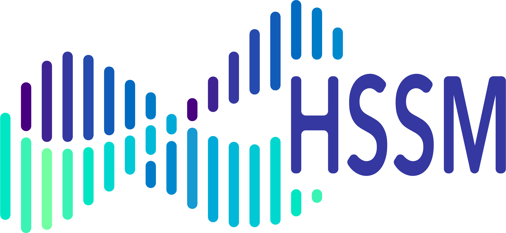

<div>
    <a href="https://ccbs.carney.brown.edu/brainstorm" style="display: block; float: right; padding: 10px">
        
    </a>
    
</div>


[](https://github.com/astral-sh/ruff)

**HSSM** (Hierarchical Sequential Sampling Modeling) is a modern open-source
Python toolbox for computational modeling in cognitive neuroscience. It supports
a broad range of sequential sampling models used to study decision-making,
learning, and other cognitive processes — from basic research to the analysis of
clinical effects. HSSM provides state-of-the-art likelihood approximation
methods within the Python Bayesian ecosystem and facilitates hierarchical model
building and inference via fast and robust MCMC samplers. User-friendly,
extensible, and flexible, it can rigorously estimate the impact of neural and
other trial-by-trial covariates through parameter-wise mixed-effects models.

HSSM is a [BRAINSTORM](https://ccbs.carney.brown.edu/brainstorm) project in
collaboration with the
[Center for Computation and Visualization (CCV)](https://ccv.brown.edu/) and the
[Center for Computational Brain Science](https://ccbs.carney.brown.edu/) within
the [Carney Institute at Brown University](https://www.brown.edu/carney/).

## Citation

Fengler, A., Xu, Y., Bera, K., Omar, A., Frank, M.J. (in preparation). HSSM: A
generalized toolbox for hierarchical bayesian estimation of computational
models in cognitive neuroscience.

## Features

- Allows approximate hierarchical Bayesian inference via various likelihood
  approximators.
- Estimate impact of neural and other trial-by-trial covariates via native
  hierarchical mixed-regression support.
- Extensible for users to add novel models with corresponding likelihoods.
- Built on PyMC with support from the Python Bayesian ecosystem at large.
- Incorporates Bambi's intuitive `lmer`-like regression parameter specification
  for within- and between-subject effects.
- (💥 New in HSSM 0.4.0) Support for reinforcement learning sequential sampling models.
- Native ArviZ support for plotting and other convenience functions to aid the
  Bayesian workflow.
- Utilizes the ONNX format for translation of differentiable likelihood
  approximators across backends.
- Broad ecosystem support for differentiable likelihoods sourced from the sbi and BayesFlow libraries.

## Example

Here is a simple example of how to use HSSM:

```python
import hssm

# Load a package-supplied dataset
cav_data = hssm.load_data("cavanagh_theta")

# Define a basic hierarchical model with trial-level covariates
model = hssm.HSSM(
    model="ddm",
    data=cav_data,
    include=[
        {
            "name": "v",
            "prior": {
                "Intercept": {"name": "Normal", "mu": 0.0, "sigma": 1.0},
                "theta": {"name": "Normal", "mu": 0.0, "sigma": 1.0},
            },
            "formula": "v ~ theta + (1|participant_id)",
            "link": "identity",
        },
    ],
)

# Sample from the posterior for this model
model.sample()
```

To quickly get started with HSSM, please follow
[this tutorial](getting_started/getting_started.ipynb). For a deeper dive into
HSSM, please follow [our main tutorial](tutorials/main_tutorial.ipynb).

## Installation

(💥 New in HSSM 0.4.0) HSSM supports installation directly through `pip` or `uv` on
all platforms.

### Install HSSM (CPU only)

Use the following command to install HSSM into your virtual environment:

```bash
pip install hssm
```

YOu can also install HSSM with `uv`:

```bash
uv add hssm
```

### Install HSSM (with GPU Support)

If you need to sample with GPU, please install JAX with GPU support before
installing HSSM:

```bash
pip install hssm[cuda12]
```

### Support for Apple Silicon, AMD, and other GPUs

JAX also has support other GPUs. Please follow the
[Official JAX installation guide](https://jax.readthedocs.io/en/latest/installation.html)
to install the correct version of JAX before installing HSSM.

### Install the dev version of HSSM

You can install the dev version of `hssm` directly from this repo:

```bash
pip install git+https://github.com/lnccbrown/HSSM.git
```

### Install HSSM on Google Colab

Google Colab comes with PyMC and JAX pre-configured. That holds true even if you
are using the GPU and TPU backend, so you simply need to install HSSM via pip on
Colab regardless of the backend you are using:

```bash
!pip install hssm
```

## Troubleshooting

!!! note

    Possible solutions to any issues with installations with hssm can be found
    [in GitHub Discussions](https://github.com/lnccbrown/HSSM/discussions). Also feel free
    to start a newdiscussion thread if you don't find answers there. We recommend installing
    HSSM into a new virtual environment with Python 3.12 through 3.14 to prevent any problems with
    dependencies during the installation process. Please note that hssm is only tested for
    python 3.12 through 3.14. Use unsupported python versions with caution.

## License

HSSM is licensed under
[Copyright 2023, Brown University, Providence, RI](LICENSE)

## Support

For questions, please feel free to
[open a discussion](https://github.com/lnccbrown/HSSM/discussions).

For bug reports and feature requests, please feel free to
[open an issue](https://github.com/lnccbrown/HSSM/issues) using the
corresponding template.

## Contributing

If you want to contribute to this project, please follow our
[contribution guidelines](CONTRIBUTING.md).
